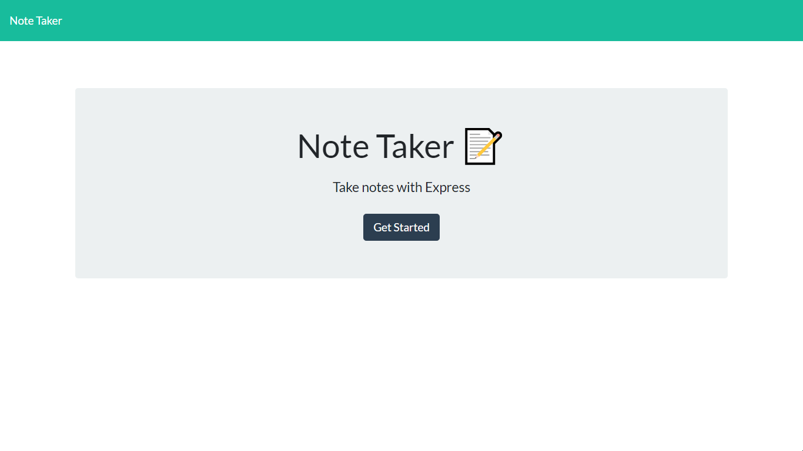
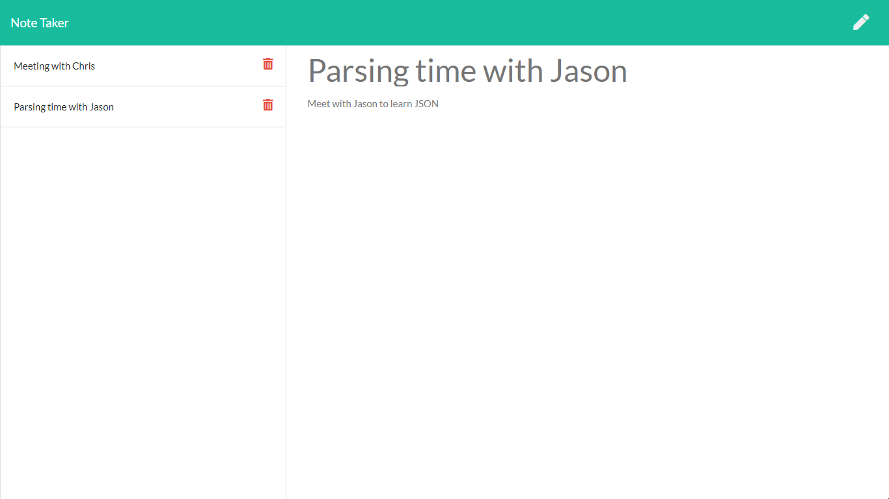

# note_taker

## LINK

### Tech
HTML, CSS, Javascript

Node.JS, Express, UUID

Bootstrap, FontAwesome

### Purpose
Create a note with a title, and save, edit, or delete it using an easy user interface.

### How to use
Open app, click button on home page to take you to note editor, write out a note, and use the icon buttons to save, edit, or delete the note.

### Screenshots
Click "Get Started" to begin taking notes:

Create and save your notes with a simple, intuitive GUI:

### Contact Me
jeffreytwoods2@icloud.com